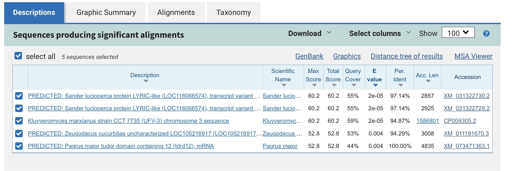

# Basic Gene Sequence Analysis Using BLAST

## Overview
This project demonstrates a basic nucleotide sequence analysis using the NCBI BLAST tool to identify similarities between a DNA sequence and known biological sequences in public databases.

## Tools Used
- NCBI BLASTn
- NCBI nucleotide database

## Workflow
1. Input a sample DNA sequence into BLAST
2. Perform sequence alignment
3. Analyze percent identity, E-value, and query coverage
4. Interpret biological significance of the matches

## Key Findings
- Multiple sequence similarities were identified across different organisms
- Significant alignments showed low E-values
- Partial query coverage was observed due to the short input sequence

## Skills Demonstrated
- Sequence alignment analysis
- Interpretation of BLAST results
- Use of biological databases
- Basic bioinformatics workflow
  
## Project Files
- PDF report with detailed explanation
- BLAST output screenshot

## BLAST Output

